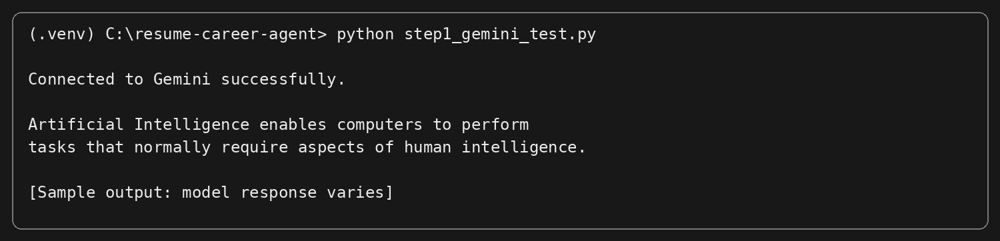
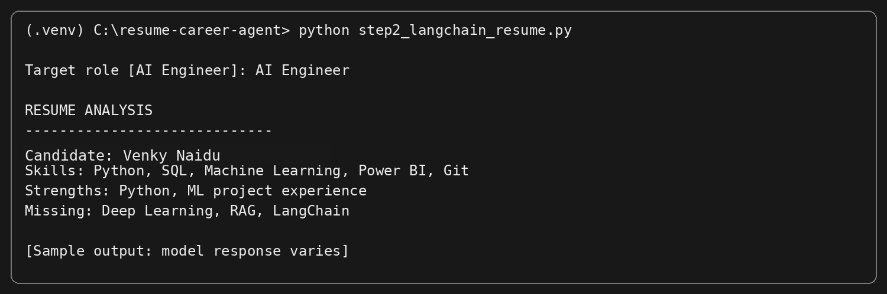
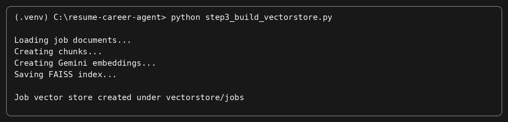
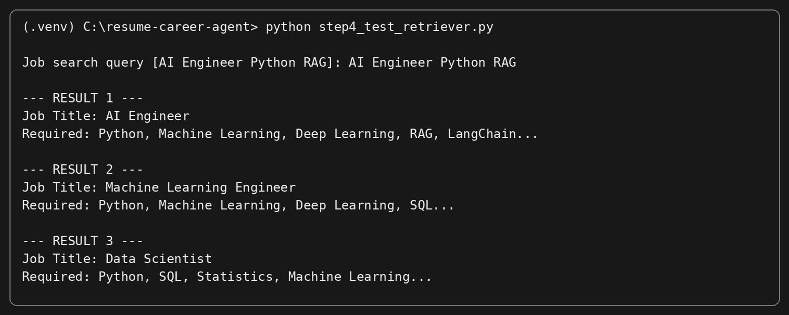
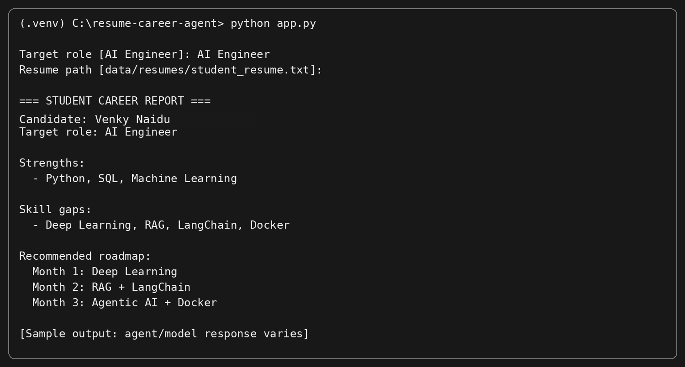

# Student Resume Analyzer & Agentic AI Career Advisor

A hands-on **LangChain + Gemini + RAG + Tools + Agentic AI** project .

The project starts with a simple Generative AI resume analyzer and progressively becomes an Agentic AI career advisor.

## What you will build

```text
Student Resume
      ↓
Gemini LLM
      ↓
LangChain Resume Analysis
      ↓
Job Documents
      ↓
Embeddings + FAISS
      ↓
RAG Job Retrieval
      ↓
LangChain Tools
      ↓
Agent
      ↓
Career Report + Skill Gap + 3-Month Roadmap
```

## Project learning progression

```text
1. Gemini API
        ↓
2. Generative AI
        ↓
3. LangChain
        ↓
4. Resume Analysis
        ↓
5. Structured Application Data
        ↓
6. Embeddings
        ↓
7. FAISS Vector Store
        ↓
8. RAG
        ↓
9. Tools
        ↓
10. Agent
        ↓
11. Agentic AI
```

---

# 1. Requirements

Recommended:

- Python 3.10+
- Internet connection
- Google account
- Gemini API key
- Git
- VS Code or another Python IDE

For the session, test the exact Python and package versions on the classroom machines before the session.

---

# 2. Create a Gemini API Key

This project uses Google Gemini. Google currently provides a Gemini API free tier subject to model availability, rate limits, quotas, and account/project conditions. Check Google's current pricing page before the session:

- Google AI Studio: https://aistudio.google.com/
- Gemini API key documentation: https://ai.google.dev/gemini-api/docs/api-key
- Gemini API getting started: https://ai.google.dev/gemini-api/docs/get-started
- Gemini API pricing: https://ai.google.dev/gemini-api/docs/pricing

## Steps

1. Open **Google AI Studio**.
2. Sign in with a Google account.
3. Open the API key / Get API key area.
4. Create or select a Google Cloud project if Google asks you to do so.
5. Create the API key.
6. Copy the key to the local `.env` file.
7. Never publish the key in GitHub, screenshots, PPTs, notebooks, or chat messages.

## Security rule

**Never do this:**

```python
api_key = "YOUR_REAL_API_KEY"
```

Use `.env` instead.

---

# 3. Clone the GitHub Repository

After you upload this project to GitHub:

```bash
git clone https://github.com/YOUR_USERNAME/resume-career-agent.git
cd resume-career-agent
```

Or download the repository ZIP and extract it.

---

# 4. Create a Virtual Environment

## Windows PowerShell

```powershell
py -m venv .venv
.\.venv\Scripts\Activate.ps1
```

If PowerShell blocks activation:

```powershell
Set-ExecutionPolicy -Scope Process -ExecutionPolicy Bypass
.\.venv\Scripts\Activate.ps1
```

## Windows CMD

```cmd
py -m venv .venv
.venv\Scripts\activate
```

## Linux/macOS

```bash
python3 -m venv .venv
source .venv/bin/activate
```

---

# 5. Install Dependencies

Upgrade pip:

```bash
python -m pip install --upgrade pip
```

Install project packages:

```bash
pip install -r requirements.txt
```

If your environment reports a missing `langchain_community` package, install:

```bash
pip install -U langchain-community
```

---

# 6. Configure `.env`

Copy:

```text
.env.example
```

to:

```text
.env
```

Example:

```text
GEMINI_API_KEY=YOUR_REAL_GEMINI_KEY
MODEL_NAME=gemini-3.5-flash
```

The model name is configurable because model availability can change.

The project also maps `GEMINI_API_KEY` to `GOOGLE_API_KEY` for LangChain's Google integrations.

---

# 7. Check the Project

Your directory should look like:

```text
resume-career-agent/
│
├── app.py
├── config.py
├── requirements.txt
├── .env
├── .env.example
├── .gitignore
│
├── data/
│   ├── resumes/
│   │   └── student_resume.txt
│   ├── jobs/
│   │   ├── ai_engineer.txt
│   │   ├── ml_engineer.txt
│   │   └── data_scientist.txt
│   └── courses/
│       ├── deep_learning.txt
│       ├── langchain.txt
│       ├── python.txt
│       └── rag.txt
│
├── src/
│   ├── agent.py
│   ├── llm.py
│   ├── models.py
│   ├── prompts.py
│   ├── rag.py
│   └── tools.py
│
└── screenshots/
    ├── 01-gemini-test.png
    ├── 02-langchain-resume.png
    ├── 03-vectorstore.png
    ├── 04-retriever.png
    └── 05-agent-final-report.png
```

---

# 8. Run the Project Step by Step

## STEP 1 — Test Gemini API

```bash
python step1_gemini_test.py
```

Expected pattern:

```text
Connected to Gemini successfully.

Artificial Intelligence enables computers ...
```

> The exact generated text depends on the selected Gemini model and can change between runs.

### Output screenshot



---

## STEP 2 — Run the LangChain Resume Analyzer

```bash
python step2_langchain_resume.py
```

Enter:

```text
Target role [AI Engineer]: AI Engineer
```

The program reads:

```text
data/resumes/student_resume.txt
```

and sends the resume to the LangChain-connected Gemini model.

### Expected result

The output should contain information such as:

- Candidate name
- Technical skills
- Projects
- Experience
- Strengths
- Weaknesses
- Missing skills

### Output screenshot



> Model wording and exact analysis will vary.

---

## STEP 3 — Build the Job Vector Store

Run:

```bash
python step3_build_vectorstore.py
```

This performs:

```text
Job text files
      ↓
Document loading
      ↓
Chunking
      ↓
Gemini embeddings
      ↓
FAISS
      ↓
vectorstore/jobs
```

Expected message:

```text
Job vector store created under vectorstore/jobs
```

### Output screenshot



---

## STEP 4 — Test Semantic Job Retrieval

Run:

```bash
python step4_test_retriever.py
```

Try:

```text
AI Engineer Python RAG LangChain
```

The retriever should return relevant job documents.

### Expected pattern

```text
--- RESULT 1 ---
AI Engineer ...

--- RESULT 2 ---
Machine Learning Engineer ...

--- RESULT 3 ---
Data Scientist ...
```

### Output screenshot



> Retrieval order can vary because semantic similarity depends on the embedding model and indexed documents.

---

# 9. Run the Complete Agentic AI Application

Finally:

```bash
python app.py
```

Example:

```text
Target role [AI Engineer]: AI Engineer
Resume path [data/resumes/student_resume.txt]:
```

You can use your own text or PDF resume:

```text
data/resumes/my_resume.pdf
```

The application then combines:

```text
Resume
  ↓
LLM Analysis
  ↓
RAG Job Retrieval
  ↓
Tools
  ↓
Agent
  ↓
Career Report
```

### Expected final report

The final response should contain:

- Candidate summary
- Current skills
- Strengths
- Weaknesses
- Relevant roles
- Matching skills
- Missing skills
- Recommended learning
- Three-month roadmap
- Final recommendation

### Output screenshot



> This screenshot is an **illustrative sample output**. LLM-generated wording, job ranking, skill-gap analysis and roadmap content will vary by model/version and input resume.

---

# 10. Replace the Sample Resume

Start with the supplied:

```text
data/resumes/student_resume.txt
```

After the baseline demo works, replace it with a student's test resume.

For PDF resumes, the application can extract text from text-based PDFs.

Scanned/image-only PDFs may require OCR or multimodal document processing.

---

# 11. Add Your Own Job Descriptions

Put `.txt` files into:

```text
data/jobs/
```

Examples:

```text
frontend_developer.txt
python_developer.txt
cloud_engineer.txt
data_engineer.txt
cyber_security_analyst.txt
```

Then rebuild the vector store:

```bash
python step3_build_vectorstore.py
```

Test again:

```bash
python step4_test_retriever.py
```

---

# 12. How the Agent Works

The project demonstrates this agentic loop:

```text
Student Goal
     ↓
Agent
     ↓
Understand task
     ↓
Choose tool / retrieval
     ↓
Execute
     ↓
Observe result
     ↓
Decide next step
     ↓
Final career report
```

Available project capabilities include:

```text
Resume analysis
Skill-gap analysis
Job retrieval
Match calculation
Learning recommendations
Career roadmap
```

---

# 13. Why LangChain Is Important in This Project

The underlying model is Gemini. LangChain is not the model.

LangChain helps organize the application around:

```text
Model
Prompt
Structured Output
Retrieval
Tools
Agent
```

The project therefore demonstrates the progression:

```text
Gemini API
   ↓
Generative AI
   ↓
LangChain
   ↓
RAG
   ↓
Tools
   ↓
Agentic AI
```

---

# 14. Troubleshooting

## `GEMINI_API_KEY is missing`

Check that `.env` exists in the project root and contains:

```text
GEMINI_API_KEY=...
```

Make sure Windows has not created:

```text
.env.txt
```

Run the command from the project root.

---

## API quota / 429 / rate limit

Gemini free access is quota-limited. Check the current Google AI Studio / Gemini API quota and pricing documentation. Reduce repeated calls during classroom testing and reuse the supplied sample data.

---

## Model not found

Change:

```text
MODEL_NAME=...
```

in `.env` to a model currently available in your Gemini API account.

---

## Vector store error

Rebuild it:

```bash
python step3_build_vectorstore.py
```

Then:

```bash
python step4_test_retriever.py
```

---

## PowerShell cannot activate the virtual environment

Run:

```powershell
Set-ExecutionPolicy -Scope Process -ExecutionPolicy Bypass
.\.venv\Scripts\Activate.ps1
```

---

## PDF has no useful text

The default PDF path works best for text-based PDF resumes. Scanned resumes may require OCR or a multimodal extraction method.

---

# 15. GitHub Upload

From the project directory:

```bash
git init
git add .
git commit -m "Initial LangChain Agentic AI resume analyzer"
```

Create an empty GitHub repository, then connect it:

```bash
git branch -M main
git remote add origin https://github.com/YOUR_USERNAME/resume-career-agent.git
git push -u origin main
```

Before the `git add .` command, verify that `.env` is ignored:

```bash
git status
```

The real API key must **not** appear in the files to be committed.

---

# 16. Trainer Pre-Project Checklist

Run all commands once on your machine:

```bash
python --version
python -m pip install --upgrade pip
pip install -r requirements.txt
python step1_gemini_test.py
python step2_langchain_resume.py
python step3_build_vectorstore.py
python step4_test_retriever.py
python app.py
```

Then test one real PDF resume.

For a classroom with many students, use separate API keys/projects or an instructor-managed access strategy appropriate to Google's current quotas and terms. Do not ask students to share private API keys.

---

# 17. Project Architecture

```text
                     STUDENT
                        │
                        ▼
                    RESUME PDF
                        │
                        ▼
                 RESUME PROCESSOR
                        │
                        ▼
                      LLM
                        │
             ┌──────────┼──────────┐
             ▼          ▼          ▼
          Skills     Projects   Experience
             │          │          │
             └──────────┼──────────┘
                        ▼
                       RAG
                        │
               Relevant Job Data
                        │
                        ▼
                      AGENT
                        │
            ┌───────────┼───────────┐
            ▼           ▼           ▼
        Skill Tool   Match Tool  Learning Tool
            └───────────┼───────────┘
                        ▼
                 Career Roadmap
                        │
                        ▼
                  FINAL REPORT
```

---

# 18. Important Note About Output Screenshots

The screenshots in `screenshots/` show the **expected terminal format and representative output** for the supplied sample data.

LLM-generated text, retrieved-document ranking, token usage and the final career recommendation can change between runs.

For a public GitHub repository, replace these illustrative screenshots with screenshots from your own successful live execution before the session if you want them to document the exact environment/model you tested.

---

## License

Use and adapt this  project for educational and demonstration purposes according to the license you choose for your GitHub repository.
